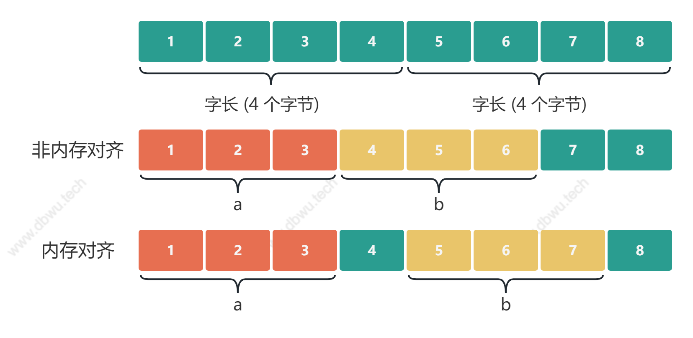

# gofmt 自动字节对齐工具

这是一个基于 Golang 源码 gofmt包开发的工具，可以实现自动对代码中struct进行字节对齐的功能。通过增加这一功能，可以使代码更加整洁、易读，提高代码质量和可维护性，并且通过字节对齐，达到节约内存的极致体验

# 为什么需要内存对齐

CPU 访问内存时，并不是逐个字节访问，而是以字长（word size）为单位访问。比如 32 位的 CPU ，字长为 4 字节，那么 CPU 访问内存的单位也是
4 字节。 这么设计的目的，是减少 CPU 访问内存的次数，提升 CPU 访问内存的吞吐量。比如同样读取 8 个字节的数据，一次读取 4
个字节那么只需要读取 2 次。

CPU 始终以字长访问内存，如果不进行内存对齐，很可能增加 CPU 访问内存的次数，例如：


变量 a、b 各占据 3 字节的空间，内存对齐后，a、b 占据 4 字节空间，CPU 读取 b 变量的值只需要进行一次内存访问。 如果不进行内存对齐，CPU
读取 b 变量的值需要进行 2 次内存访问。第一次访问得到 b 变量的第 1 个字节，第二次访问得到 b 变量的后两个字节。

从这个例子中也可以看到，内存对齐对实现变量的原子性操作也是有好处的，每次内存访问是原子的，如果变量的大小不超过字长，那么内存对齐后，
对该变量的访问就是原子的，这个特性在并发场景下至关重要。

``内存对齐可以提高内存读写性能，并且便于实现原子性操作。``

# 内存对齐规则

|            类型             |           大小            |
|:-------------------------:|:-----------------------:|
|           bool            |          1个字节           |
| intN,uintN,floatN,comlexN | N/8个字节(例如 float64是8个字节) |
|     int,uint,uintptr      |           1个字           |
|            *T             |           1个字           |
|          string           |       2个字(数据、长度)        |
|            []T            |      3个字(数据、长度、内容)      |
|            map            |           1个字           |
|           func            |           1个字           |
|           chan            |           1个字           |
|         interface         |         2个字(类型)         |

```字长跟CPU相关，32位CPU一个字长就是4字节，64位CPU一个字长是8字节```


## 安装

```bash
git cloe git@github.com:code-innovator-zyx/gofmt.git
```

## 使用方法

```bash
yourtool align yourfile.go
```

## 示例

```go
// Before alignment


// After alignment

```

## 注意事项

- 本工具仅支持 Golang 代码的字节对齐。

## 贡献

如果您对本工具有任何建议或改进意见，欢迎提交 issue 或 pull request。

## 许可证

MIT License

感谢您使用工具！祝您编程愉快！